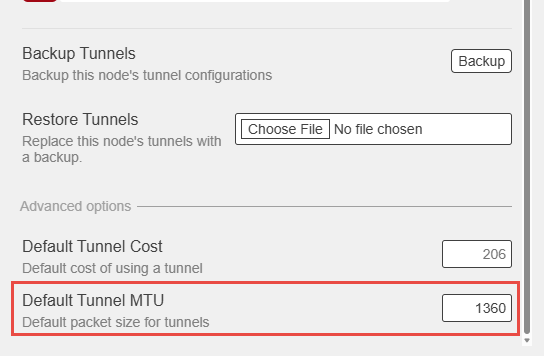

# 44-net for AREDN


Getting 44net address space to your station, and using it to carry AREDN tunnel links. Written
for operators who want to do the same.

## 📻 First — you may need none of this

**If you only want to link to a node whose tunnel endpoint is a 44 address, there is nothing to
do.**

44net is globally routed public address space. Your node reaches `44.x.y.z` exactly as it
reaches any other internet address. Set the tunnel up normally. No allocation, no gateway, no
router changes.

This catches people out regularly. A peer having a 44 address does not mean you need 44
anything.

---

Beyond that, two quite different goals get called "using 44net". They stack — the second needs
the first — but they are worth keeping apart, because the awkward parts belong to the second.

| | Goal | What it involves |
|---|---|---|
| **A** | 44net addresses for your station or home network | An allocation, a gateway tunnel, router configuration |
| **B** | AREDN tunnel links carried over 44net | Everything in A, plus per-peer coordination and an MTU problem |

# A · 44net addresses for your station

Your network currently reaches the world through your provider's address. Every service is
squeezed through a port forward, and your machines never see who is really calling — only your
router's translated view.

44net is address space allocated to licensed amateurs. With a block of your own, a machine at
your station holds a genuine public address: reachable on its normal ports, addressed as
itself, and independent of whatever your provider hands you this month.

```
                                    44net gateway
                                          │
                    WireGuard tunnel, carries your /28
                                          ▼
                              ┌──────────────────────┐
                              │  your router         │
                              │  holds 44net .1      │
                              └──────────────────────┘
                                          │
                        ┌─────────────────┴─────────────────┐
                        ▼                                   ▼
                ┌──────────────┐                    ┌──────────────┐
                │  station .2  │                    │  station .3  │
                └──────────────┘                    └──────────────┘
```

This part has nothing to do with AREDN. What sits on those addresses is up to you — an AREDN
node, a remote station, a server.

## 🌐 On the 44Net Connect portal

Two steps at [connect.44net.cloud](https://connect.44net.cloud), before any router work. You
need a portal.ampr.org login, and an allocation requested from [ARDC](https://www.ampr.org/) —
a `/28` gives 13 usable addresses.

**Generate a WireGuard keypair on your router first.** The portal wants your public key, and
the private key should never leave the router.

### Tunnels — [connect.44net.cloud/tunnels](https://connect.44net.cloud/tunnels)

1. Request a new tunnel and select a gateway server. It carries all your 44net traffic, so pick
   one close to you.
2. Paste your **public key**.
3. Create the tunnel.

The portal returns a wg-quick configuration with the three values your router needs:

| From the portal | Used as |
|---|---|
| Gateway public key | the peer's public key |
| Endpoint address and port | `endpoint-address` / `endpoint-port` |
| An address for your tunnel interface | a `/32` on the tunnel interface |

### Networks — [connect.44net.cloud/networks](https://connect.44net.cloud/networks)

Associate your allocated prefix with the tunnel you just created, so the gateway routes it down
that tunnel to you.

**Do not skip it.** With only the tunnel created, it comes up and handshakes happily while
nothing is routed to you and your allocation stays unreachable — which looks like a broken
tunnel and is not.

> The networks page is not covered in the public wiki and the portal needs a login, so this is
> inferred from the resulting configuration rather than from the page. Corrections welcome.

## ⚙️ On the router

```
# 1. The gateway tunnel, from the portal's configuration
/interface/wireguard/add name=<tunnel> private-key="<key>" mtu=<tunnel-mtu> listen-port=<port>
/interface/wireguard/peers/add interface=<tunnel> public-key="<gateway-key>" \
    allowed-address=0.0.0.0/0 endpoint-address=<gateway> endpoint-port=<gw-port> \
    persistent-keepalive=20s

# 2. The gateway's own address must NOT route into the tunnel
/ip/route/add dst-address=<gateway>/32 gateway=<your-isp-gateway>

# 3. 44net via the tunnel
/ip/route/add dst-address=44.0.0.0/9    gateway=<tunnel>
/ip/route/add dst-address=44.128.0.0/10 gateway=<tunnel>

# 4. So your own LAN can reach 44net through it
/ip/firewall/nat/add chain=srcnat action=masquerade out-interface=<tunnel> \
    src-address=<your-lan-subnet>

# 5. A VLAN for the 44net segment, router holds .1, DHCP with static leases
```

Two steps are easy to miss and both fail confusingly:

**Step 2 is not optional.** The gateway's own address lies inside `44.0.0.0/9`, so without a
more specific route the tunnel's traffic is routed into itself and it dies the moment you add
step 3.

**Without step 4, 44net becomes *less* reachable than before you started.** Packets from your
LAN enter the tunnel carrying a private source address that nothing can reply to.

`44.192.0.0/10` is deliberately absent from step 3 — that block was sold and is not 44net.

### Firewall

Your allocation is public space and is scanned continuously from the open internet.

```
# Allow only what each machine actually serves
/ip/firewall/filter/add chain=forward action=accept in-interface=<tunnel> \
    protocol=udp dst-address=<host> dst-port=<ports>

# Drop everything else arriving from the tunnel
/ip/firewall/filter/add chain=forward action=drop connection-state=new in-interface=<tunnel>
```

Put both **at the very top of the forward chain**. Any address-based accept rule above them — a
port forward to a web server, a rule between two of your own subnets — will also match traffic
from the tunnel, because it was written without the tunnel in mind.

Never use a subnet-wide accept, and do not add the tunnel to your LAN interface list.

---

# B · AREDN tunnel links over 44net

Everything above gets your node a 44net address. This part is about how **peer nodes reach it**,
and it is where the coordination and the MTU problem live.

Three variants, and you will pass through all of them in order.

## 1. Port forwarding — where you are today

```
   peer's AREDN node
          │
          │  dials YOUR-PUBLIC-IP : 5525
          ▼
   ┌──────────────────────┐
   │  your router         │   address from your ISP
   │  port forward        │
   └──────────────────────┘
          │  translated to a private address
          ▼
   ┌──────────────────────┐
   │  AREDN node          │   192.168.x.y
   └──────────────────────┘
```

Ordinary internet at 1500 the whole way. A peer at AREDN's 1420 default fits comfortably.
Nothing to tune, works with every firmware version.

**What it costs:** one shared address, a port forward per service, and your node never sees the
real source address of anyone talking to it.

## 2. Peers dial your 44net address

```
   peer's AREDN node                        44net gateway
          │                                       │
          │  dials YOUR-44NET-ADDRESS             │
          └──────────► internet ──────────────────┘
                                                  │
                       WireGuard tunnel, carries your /28
                                                  ▼
                                       ┌──────────────────────┐
                                       │  your router         │
                                       └──────────────────────┘
                                                  │
                                                  ▼
                                       ┌──────────────────────┐
                                       │  AREDN node   .2     │
                                       └──────────────────────┘
```

**The catch:** the peer's tunnel now runs *inside* your gateway tunnel. Two layers of
encapsulation, and the inner one no longer fits. **Both ends** must reduce their tunnel MTU.

This is the only variant that needs anything from the other operator.

## 3. Migration — both at once

```
   peer not yet ready              peer ready
          │                             │
          │ dials your ISP address      │ dials your 44net address
          ▼                             ▼
   ┌──────────────┐             ┌──────────────────┐
   │ port forward │             │  gateway tunnel  │
   └──────────────┘             └──────────────────┘
          │                             │
          └──────────────┬──────────────┘
                         ▼
                 ┌──────────────┐
                 │  AREDN node  │
                 └──────────────┘
```

Both paths live simultaneously. Peers move individually once they have set their MTU, and
anyone who cannot keeps the old path indefinitely.

**This is the only sane way to do it.** Your own MTU you fix in a minute; your peers' you
cannot, and some are on firmware with no supported way to set it.

## 🖥️ On the AREDN node

| | Variant 1 | Variants 2 & 3 |
|---|---|---|
| WAN interface | on your LAN, DHCP | on the 44net VLAN, DHCP |
| Address | private, from your router | 44net, from a static DHCP lease keyed to its WAN MAC |
| **Default Tunnel MTU** | default 1420 | **1360** |
| Anything else | — | nothing |

A static DHCP lease rather than a static address inside AREDN matters: the node keeps
`proto=dhcp`, nothing in its own configuration changes, and there is nothing for a firmware
upgrade to discard.

### If the node runs on Proxmox

```bash
qm snapshot <vmid> pre-44net
qm set <vmid> -net1 virtio=<mac>,bridge=vmbr0,tag=<44net-vlan>
```

virtio hot-plugs, so no reboot. The snapshot captures the VM configuration *and* the disk, so
`qm rollback` undoes both the VLAN change and anything altered inside AREDN in one step.

An AREDN node has three interfaces — LAN, WAN and DtD — bridged internally. **Only the WAN one
moves.** Bind the DHCP lease to the MAC of the node's **`br-wan` bridge**, not the MAC in the VM
configuration; AREDN builds its own bridges and it is `br-wan` that requests the lease.

## 📏 The MTU problem

Applies to variants 2 and 3 only. It is what makes them need per-peer coordination.

| | |
|---|---|
| Ordinary internet path | 1500 |
| Usable inside a WireGuard gateway tunnel | about 1420 |
| An AREDN tunnel at its 1420 default emits | about 1480 |

1480 does not fit in 1420. The failure is silent, because handshake packets are small enough to
get through: the tunnel connects, looks healthy, and never routes.

**What you see:** the peer appears in your mesh as a bare MAC address, no hostname, no Babel
metric.

**How to confirm** — any interface with a live handshake but no Babel neighbour:

```sh
wg show all latest-handshakes
echo dump | socat -T 8 -t 8 UNIX-CLIENT:/var/run/babel.sock - | grep neighbour
```

**The fix**, on both ends of every tunnel crossing the gateway. AREDN web interface,
**Tunnels → Advanced**:



> The default packet (MTU) size for all tunnels. This can be set between 1280 and 1420 if your
> WAN network requires smaller packets than normal. Any change will affect all tunnels.
> **Remember to change the MTU size at the other end.**

Note AREDN's own warning: *remember to change it at the other end*. That is why migration is
per-peer.

**Firmware matters.** This field is recent. Older releases have no supported way to set tunnel
MTU — only `ip link set dev <iface> mtu 1360`, lost at the next reboot. Check before promising
a peer anything.

## 🤝 Bringing peers across

Per peer, in this order — the order matters:

1. They set **Default Tunnel MTU** to 1360 and let tunnels re-establish.
2. They repoint the tunnel at your 44net address, same port.
3. Confirm a Babel neighbour appears with a sensible cost — not just a WireGuard handshake.
4. Retire the port forward only when everyone has moved. There is no hurry.

[docs/peer-letter.md](docs/peer-letter.md) is a template you can send.

If step 3 shows a handshake with no Babel neighbour, the MTU is still wrong somewhere. Put them
back on the old address while you work it out.

## ⚠️ Dead tunnels are not free

A tunnel that is connected but not routing still advertises a near-complete copy of the mesh at
an unusable cost, and your routing daemon re-evaluates all of it. On one supernode, three such
links accounted for most of a CPU core and roughly 40% of the routing table.

If a peer is unreachable, disable the tunnel rather than leaving it connected.

## 📚 Documentation

| Document | What it covers |
|---|---|
| [docs/enabling-44net.md](docs/enabling-44net.md) | Full setup guide with configuration examples |
| [docs/peer-letter.md](docs/peer-letter.md) | Template letter asking a peer to move |
| [docs/tunnels.md](docs/tunnels.md) | Tunnel roles, what each link needs, MTU arithmetic |
| [docs/test-procedure.md](docs/test-procedure.md) | Proving the open paths work and the closed ones do not |
| [docs/operations.md](docs/operations.md) | Health checks, consoles, recovery |
| [docs/concept.md](docs/concept.md) | Architecture and firewall design in detail |
| [docs/migration.md](docs/migration.md) | Per-node cutover runbook |

## 🔗 References

- [AREDN](https://www.arednmesh.org/) — Amateur Radio Emergency Data Network
- [ARDC](https://www.ampr.org/) — allocates 44net space
- [44Net Connect](https://wiki.ampr.org/wiki/44Net_Connect) — the WireGuard gateway service
- [AREDN issue #2594](https://github.com/aredn/aredn/issues/2594) — the MTU behaviour, still open
